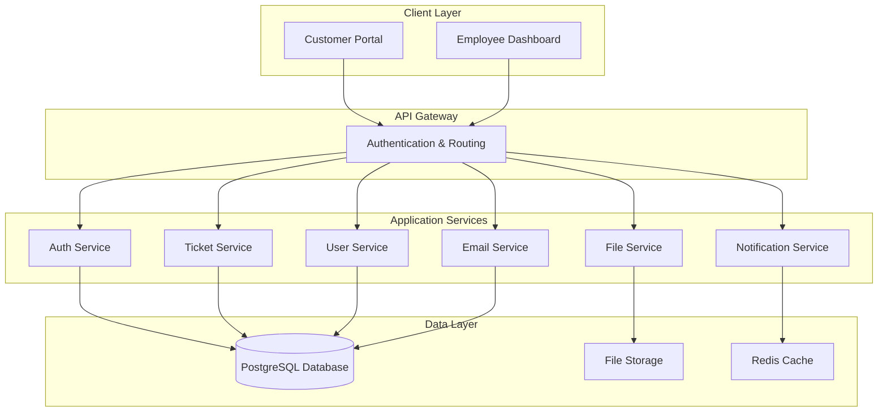
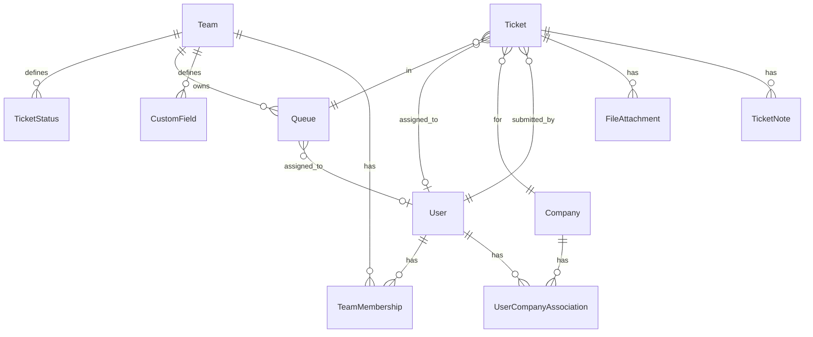

# Bomizzel Ticketing System Design Document

## Overview

The Bomizzel ticketing system is designed as a modern web application with separate customer and employee interfaces, built on a scalable architecture that supports multi-tenancy, customizable workflows, and real-time collaboration. The system uses a microservices approach with a shared database layer, RESTful APIs, and a responsive frontend framework.

## Architecture

### High-Level Architecture



### Technology Stack

- **Frontend**: React.js with TypeScript for both customer and employee interfaces
- **Backend**: Node.js with Express.js framework
- **Database**: PostgreSQL for relational data storage
- **Caching**: Redis for session management and real-time features
- **File Storage**: AWS S3 or compatible object storage
- **Authentication**: JWT tokens with refresh token rotation
- **Real-time Updates**: WebSocket connections for live dashboard updates

## Components and Interfaces

### 1. Authentication Service

**Purpose**: Manages user authentication, authorization, and session management for both customers and employees.

**Key Features**:
- JWT-based authentication with refresh tokens
- Role-based access control (Customer, Employee, Team Lead, Admin)
- Multi-company association management for customers
- Password reset and email verification flows

**API Endpoints**:
```
POST /auth/register - Customer registration
POST /auth/login - User authentication
POST /auth/refresh - Token refresh
POST /auth/logout - Session termination
GET /auth/profile - User profile information
PUT /auth/profile - Update user profile
```

### 2. User Service

**Purpose**: Manages user profiles, company associations, and team memberships.

**Key Features**:
- Customer profile management
- Company account creation and association
- Employee team assignments
- User preference storage (view settings, notifications)

**API Endpoints**:
```
GET /users/companies - List user's company associations
POST /users/companies - Create new company association
GET /users/teams - List employee's team memberships
PUT /users/preferences - Update user preferences
```

### 3. Ticket Service

**Purpose**: Core ticket management including creation, assignment, status updates, and custom field handling.

**Key Features**:
- Ticket CRUD operations
- Custom field configuration and validation
- Queue management and assignment logic
- Status workflow management
- Priority and ordering management

**API Endpoints**:
```
POST /tickets - Create new ticket
GET /tickets - List tickets (filtered by user permissions)
GET /tickets/:id - Get ticket details
PUT /tickets/:id - Update ticket
PUT /tickets/:id/assign - Assign ticket to employee
PUT /tickets/:id/status - Update ticket status
PUT /tickets/:id/priority - Update ticket priority
GET /queues - List available queues
GET /queues/:id/tickets - Get tickets in specific queue
```

### 4. Custom Fields Service

**Purpose**: Manages dynamic form fields that teams can configure for their ticket types.

**Key Features**:
- Field type definitions (string, number, decimal, integer, picklist)
- Field validation rules
- Team-specific field configurations
- Dynamic form rendering support

**API Endpoints**:
```
GET /custom-fields/teams/:teamId - Get team's custom fields
POST /custom-fields - Create new custom field
PUT /custom-fields/:id - Update custom field
DELETE /custom-fields/:id - Delete custom field
POST /custom-fields/validate - Validate field values
```

### 5. File Service

**Purpose**: Handles file uploads, storage, and retrieval for ticket attachments.

**Key Features**:
- Secure file upload with virus scanning
- File type and size validation
- Thumbnail generation for images
- Access control based on ticket permissions

**API Endpoints**:
```
POST /files/upload - Upload file attachment
GET /files/:id - Download file
DELETE /files/:id - Delete file
GET /files/:id/thumbnail - Get image thumbnail
```

### 6. Email Service

**Purpose**: Manages email communications and integration with ticket notes.

**Key Features**:
- SMTP integration for outbound emails
- Email template management
- Automatic note creation from sent emails
- Email threading and reply tracking

**API Endpoints**:
```
POST /email/send - Send email from ticket
GET /email/templates - List email templates
POST /email/templates - Create email template
```

### 7. Notification Service

**Purpose**: Handles real-time notifications and dashboard updates.

**Key Features**:
- WebSocket connections for real-time updates
- Push notifications for ticket assignments
- Dashboard metric updates
- Email notification scheduling

**WebSocket Events**:
```
ticket:created - New ticket notification
ticket:assigned - Ticket assignment notification
ticket:updated - Ticket status/priority changes
queue:metrics - Real-time queue statistics
```

## Data Models

### Core Entities

```typescript
interface User {
  id: string;
  email: string;
  firstName: string;
  lastName: string;
  role: 'customer' | 'employee' | 'team_lead' | 'admin';
  isActive: boolean;
  preferences: UserPreferences;
  createdAt: Date;
  updatedAt: Date;
}

interface Company {
  id: string;
  name: string;
  domain: string;
  isActive: boolean;
  createdAt: Date;
  updatedAt: Date;
}

interface UserCompanyAssociation {
  userId: string;
  companyId: string;
  role: string;
  createdAt: Date;
}

interface Team {
  id: string;
  name: string;
  description: string;
  isActive: boolean;
  customFields: CustomField[];
  customStatuses: TicketStatus[];
  createdAt: Date;
  updatedAt: Date;
}

interface Ticket {
  id: string;
  title: string;
  description: string;
  status: string;
  priority: number;
  submitterId: string;
  companyId: string;
  assignedToId?: string;
  queueId: string;
  teamId: string;
  customFieldValues: Record<string, any>;
  createdAt: Date;
  updatedAt: Date;
}

interface CustomField {
  id: string;
  teamId: string;
  name: string;
  label: string;
  type: 'string' | 'number' | 'decimal' | 'integer' | 'picklist';
  isRequired: boolean;
  options?: string[]; // For picklist type
  validation?: FieldValidation;
  order: number;
  createdAt: Date;
}

interface Queue {
  id: string;
  name: string;
  type: 'unassigned' | 'employee';
  assignedToId?: string;
  teamId: string;
  isActive: boolean;
  createdAt: Date;
}

interface TicketNote {
  id: string;
  ticketId: string;
  authorId: string;
  content: string;
  isInternal: boolean;
  isEmailGenerated: boolean;
  emailMetadata?: EmailMetadata;
  createdAt: Date;
}

interface FileAttachment {
  id: string;
  ticketId: string;
  fileName: string;
  fileSize: number;
  mimeType: string;
  uploadedById: string;
  storageKey: string;
  createdAt: Date;
}
```

### Database Schema Relationships



## Error Handling

### Error Response Format

All API endpoints return consistent error responses:

```typescript
interface ErrorResponse {
  error: {
    code: string;
    message: string;
    details?: Record<string, any>;
    timestamp: string;
    requestId: string;
  };
}
```

### Error Categories

1. **Authentication Errors** (401)
   - Invalid credentials
   - Expired tokens
   - Insufficient permissions

2. **Validation Errors** (400)
   - Missing required fields
   - Invalid field formats
   - Custom field validation failures

3. **Authorization Errors** (403)
   - Access to tickets outside company scope
   - Unauthorized queue access
   - Team configuration restrictions

4. **Resource Errors** (404)
   - Ticket not found
   - User not found
   - Queue not found

5. **Business Logic Errors** (422)
   - Invalid status transitions
   - Assignment conflicts
   - File upload restrictions

### Error Handling Strategy

- **Client-side**: Graceful error display with user-friendly messages
- **Server-side**: Comprehensive logging with correlation IDs
- **Monitoring**: Real-time error tracking and alerting
- **Recovery**: Automatic retry mechanisms for transient failures

## Testing Strategy

### Unit Testing

**Coverage Requirements**: Minimum 80% code coverage for all services

**Key Areas**:
- Custom field validation logic
- Ticket assignment algorithms
- Permission checking functions
- Email template rendering
- File upload validation

**Tools**: Jest for JavaScript/TypeScript testing

### Integration Testing

**API Testing**:
- All REST endpoints with various input scenarios
- Authentication and authorization flows
- File upload and download processes
- Email sending and note creation

**Database Testing**:
- Data integrity constraints
- Complex query performance
- Transaction rollback scenarios

**Tools**: Supertest for API testing, Docker for test database isolation

### End-to-End Testing

**User Workflows**:
- Complete customer registration and ticket submission flow
- Employee ticket assignment and resolution process
- Custom field configuration and usage
- Multi-company ticket visibility rules

**Tools**: Playwright for browser automation

### Performance Testing

**Load Testing**:
- Concurrent user sessions (target: 1000+ simultaneous users)
- Ticket creation under load
- Dashboard real-time updates performance
- File upload stress testing

**Database Performance**:
- Query optimization for large ticket datasets
- Index effectiveness for search operations
- Connection pool management under load

**Tools**: Artillery for load testing, PostgreSQL EXPLAIN for query analysis

### Security Testing

**Authentication Security**:
- JWT token validation and expiration
- Password strength requirements
- Session management security

**Authorization Testing**:
- Multi-company data isolation
- Role-based access control
- API endpoint permission validation

**File Security**:
- Malicious file upload prevention
- File access authorization
- Storage security validation

**Tools**: OWASP ZAP for security scanning, custom security test suites