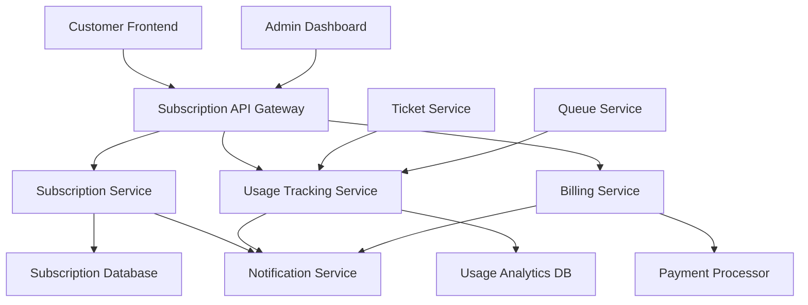

# Subscription Management System Design

## Overview

The Subscription Management system transforms Bomizzel into a revenue-generating SaaS platform by implementing a tiered pricing model with automated usage tracking and limit enforcement. The design focuses on seamless user experience, reliable billing integration, and comprehensive analytics to support Bomar Inc.'s business growth objectives.

## Architecture

### High-Level Architecture



### Service Layer Architecture

The subscription system integrates with the existing Bomizzel architecture through a service-oriented approach:

- **Subscription Service**: Core subscription management and plan enforcement
- **Usage Tracking Service**: Real-time monitoring of ticket creation and completion
- **Billing Service**: Payment processing and revenue management
- **Notification Service**: Automated alerts and upgrade prompts
- **Analytics Service**: Revenue metrics and customer insights

## Components and Interfaces

### 1. Subscription Management Component

**Purpose**: Central hub for managing customer subscription plans and limits

**Key Interfaces**:
```typescript
interface SubscriptionManager {
  createSubscription(userId: string, planId: string): Promise<Subscription>
  upgradeSubscription(subscriptionId: string, newPlanId: string): Promise<Subscription>
  checkUsageLimits(subscriptionId: string): Promise<UsageLimitStatus>
  enforceTicketLimit(userId: string, ticketType: 'active' | 'completed'): Promise<boolean>
  getSubscriptionDetails(userId: string): Promise<SubscriptionDetails>
}

interface Subscription {
  id: string
  userId: string
  planId: string
  status: 'active' | 'trial' | 'cancelled' | 'past_due'
  currentPeriodStart: Date
  currentPeriodEnd: Date
  trialEnd?: Date
  limits: PlanLimits
  usage: CurrentUsage
}
```

### 2. Usage Tracking Component

**Purpose**: Real-time monitoring and enforcement of subscription limits

**Key Interfaces**:
```typescript
interface UsageTracker {
  recordTicketCreation(userId: string, ticketType: 'active' | 'completed'): Promise<void>
  recordTicketStatusChange(ticketId: string, oldStatus: string, newStatus: string): Promise<void>
  getCurrentUsage(userId: string): Promise<UsageStats>
  checkLimitApproach(userId: string): Promise<LimitWarning[]>
}

interface UsageStats {
  activeTickets: number
  completedTickets: number
  totalTickets: number
  percentageUsed: {
    active: number
    completed: number
    total: number
  }
}
```

### 3. Pricing Page Component

**Purpose**: Professional marketing page showcasing all subscription tiers

**Features**:
- Responsive design with clear tier comparison
- Interactive plan selection with immediate signup
- FAQ section addressing common billing questions
- Social proof and feature highlights
- Mobile-optimized pricing cards

### 4. Subscription Dashboard Component

**Purpose**: Customer-facing subscription management interface

**Features**:
- Current plan overview with usage meters
- Billing history and next payment date
- One-click plan upgrades with immediate effect
- Usage warnings and limit notifications
- Payment method management

### 5. Admin Analytics Component

**Purpose**: Revenue tracking and business intelligence for Bomar Inc.

**Features**:
- Monthly recurring revenue (MRR) tracking
- Customer lifetime value (CLV) calculations
- Conversion funnel from free to paid plans
- Churn analysis and retention metrics
- Usage pattern identification for upselling

## Data Models

### Subscription Model
```typescript
interface SubscriptionPlan {
  id: string
  name: string
  price: number
  currency: string
  billingInterval: 'month' | 'year'
  limits: {
    activeTickets: number // -1 for unlimited
    completedTickets: number // -1 for unlimited
    totalTickets: number // -1 for unlimited
  }
  features: string[]
  trialDays: number
}

interface CustomerSubscription {
  id: string
  customerId: string
  planId: string
  status: SubscriptionStatus
  currentPeriodStart: Date
  currentPeriodEnd: Date
  trialEnd?: Date
  cancelAtPeriodEnd: boolean
  paymentMethodId?: string
  createdAt: Date
  updatedAt: Date
}
```

### Usage Tracking Model
```typescript
interface UsageRecord {
  id: string
  subscriptionId: string
  ticketId: string
  action: 'created' | 'completed' | 'archived'
  timestamp: Date
  previousStatus?: string
  newStatus?: string
}

interface UsageSummary {
  subscriptionId: string
  period: string // YYYY-MM format
  activeTicketsCount: number
  completedTicketsCount: number
  totalTicketsCount: number
  lastUpdated: Date
}
```

### Billing Model
```typescript
interface BillingRecord {
  id: string
  subscriptionId: string
  amount: number
  currency: string
  status: 'pending' | 'paid' | 'failed' | 'refunded'
  billingDate: Date
  paidDate?: Date
  paymentMethodId: string
  invoiceUrl?: string
}
```

## Error Handling

### Subscription Limit Enforcement
- **Graceful Degradation**: When limits are reached, provide clear messaging with upgrade options
- **Soft Limits**: Allow slight overages with immediate upgrade prompts
- **Rollback Protection**: Prevent data loss during failed payment processing

### Payment Processing
- **Retry Logic**: Automatic retry for failed payments with exponential backoff
- **Dunning Management**: Progressive email sequence for failed payments
- **Grace Period**: 7-day grace period before service suspension

### Data Consistency
- **Transaction Management**: Ensure atomic operations for subscription changes
- **Event Sourcing**: Maintain audit trail of all subscription modifications
- **Conflict Resolution**: Handle concurrent usage updates with proper locking

## Testing Strategy

### Unit Testing
- **Subscription Service**: Test plan upgrades, downgrades, and limit enforcement
- **Usage Tracking**: Verify accurate counting and limit calculations
- **Billing Logic**: Test proration, trial handling, and payment processing

### Integration Testing
- **Payment Gateway**: Test successful and failed payment scenarios
- **Email Notifications**: Verify delivery of usage warnings and billing alerts
- **Database Consistency**: Test concurrent usage updates and subscription changes

### End-to-End Testing
- **Customer Journey**: Test complete signup to upgrade flow
- **Limit Enforcement**: Verify ticket creation blocking at various limits
- **Billing Cycle**: Test monthly billing and automatic renewals

### Performance Testing
- **Usage Tracking**: Test real-time updates under high ticket volume
- **Subscription Queries**: Optimize database queries for large customer bases
- **Payment Processing**: Test concurrent payment processing capabilities

## Security Considerations

### Payment Data Protection
- **PCI Compliance**: Use certified payment processors (Stripe/PayPal)
- **Token Storage**: Store payment method tokens, never raw card data
- **Encryption**: Encrypt all billing-related data at rest and in transit

### Subscription Access Control
- **Authorization**: Verify customer access to subscription management features
- **Plan Validation**: Prevent unauthorized plan modifications
- **Usage Verification**: Validate usage data integrity and prevent manipulation

### Audit Trail
- **Change Logging**: Log all subscription modifications with timestamps
- **Access Monitoring**: Track administrative access to billing data
- **Compliance Reporting**: Generate audit reports for financial compliance

## Implementation Phases

### Phase 1: Core Subscription Management (Week 1-2)
- Implement basic subscription plans and customer assignment
- Create usage tracking infrastructure
- Build limit enforcement for ticket creation

### Phase 2: Customer Interface (Week 3-4)
- Develop pricing page with professional design
- Create subscription dashboard for customers
- Implement plan upgrade/downgrade functionality

### Phase 3: Billing Integration (Week 5-6)
- Integrate payment processing with Stripe
- Implement trial period management
- Create billing history and invoice generation

### Phase 4: Analytics and Optimization (Week 7-8)
- Build revenue analytics dashboard
- Implement usage warnings and notifications
- Create customer success metrics and reporting

### Phase 5: Advanced Features (Week 9-10)
- Add ticket archival for limit management
- Implement advanced billing features (proration, discounts)
- Create automated customer success workflows

## Monitoring and Metrics

### Business Metrics
- **Monthly Recurring Revenue (MRR)**: Track revenue growth across all plans
- **Customer Acquisition Cost (CAC)**: Monitor cost efficiency of customer acquisition
- **Lifetime Value (LTV)**: Calculate long-term customer profitability
- **Churn Rate**: Track customer retention by plan tier

### Technical Metrics
- **Usage Tracking Accuracy**: Ensure 99.9% accuracy in ticket counting
- **Payment Success Rate**: Monitor payment processing reliability
- **API Response Times**: Track subscription service performance
- **System Availability**: Maintain 99.9% uptime for billing operations

### Customer Success Metrics
- **Trial Conversion Rate**: Track free trial to paid plan conversions
- **Upgrade Rate**: Monitor customer progression through plan tiers
- **Support Ticket Volume**: Track support requests related to billing
- **Customer Satisfaction**: Monitor NPS scores for subscription experience